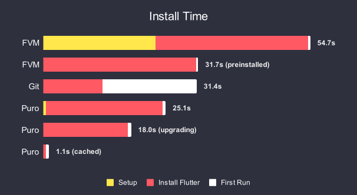
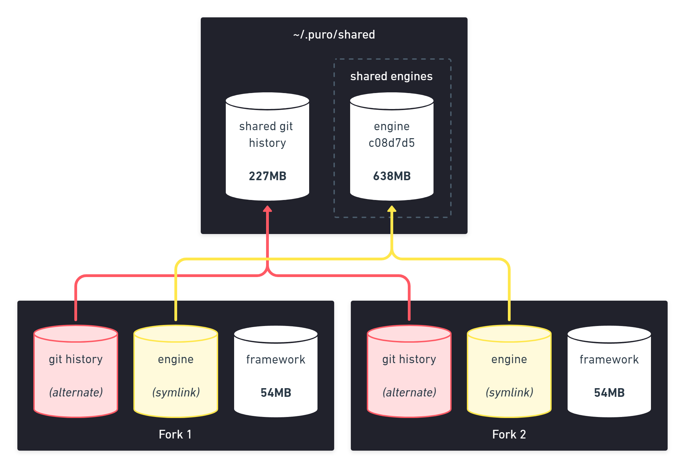

# About

Puro is an experimental tool for installing and managing flutter versions.

## Quick start

=== "Windows"

    Puro has a graphical installer for Windows:

    [:material-monitor-arrow-down-variant: Desktop Installer](https://puro.dev/builds/master/windows-x64/puro_installer.exe){ .md-button .md-button--primary }

    It can also be installed from powershell:

    ```ps1
    Invoke-WebRequest -Uri "https://puro.dev/builds/master/windows-x64/puro_0.4.0%2B933e6d1_installer.exe" -OutFile "$env:temp\puro_installer.exe"; &"$env:temp\puro_installer.exe" /VERYSILENT
    ```

    Or as a standalone executable:

    [:material-console: Standalone](https://puro.dev/builds/master/windows-x64/puro.exe){ .md-button }
    
=== "Linux"

    Puro can be installed on Linux with the following command:

    ```sh
    curl -o- https://puro.dev/install.sh | bash
    ```

    Or as a standalone executable:

    [:material-console: Standalone](https://puro.dev/builds/master/linux-x64/puro){ .md-button }

=== "Mac"

    Puro can be installed on Mac with the following command:

    ```sh
    curl -o- https://puro.dev/install.sh | bash
    ```

    Or as a standalone executable:

    [:material-console: Standalone](https://puro.dev/builds/master/darwin-x64/puro){ .md-button }

Once installed you can create and use an environment:

```sh
puro create my_env stable
puro use my_env
```

And that's it! Your IDE will be automatically configured to use the new environment.

## Performance

Puro implements a few optimizations that make installing Flutter as fast as possible, making first-time installs 20% faster while improving subsequent installations by a whopping 50-95%:



This also translates into much lower network usage:


## How it works

Puro achieves these performance gains with a few smart optimizations:

* Parallel git clone and engine download
* Global cache for git history
* Global cache for engine versions

With other approaches, each flutter repository is in its own folder, requiring you to download and store the git history, engine, and framework of each version:


Puro implements a technology similar to GitLab's [object deduplication](https://docs.gitlab.com/ee/development/git_object_deduplication.html) to avoid downloading the same git objects over and over again. It also uses symlinks to share the same engine version between multiple installs:

